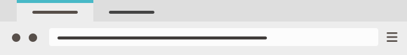
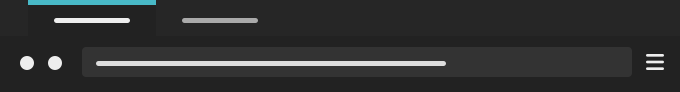

# Unofficial Pop!_OS Firefox Color Themes

These are unofficial [Firefox](https://www.mozilla.org/firefox/) themes based on the style of [Pop!\_OS](https://system76.com/pop). The themes are made with [Firefox Color](https://color.firefox.com/?theme=XQAAAAL9AAAAAAAAAABBKYhm849SCia2CaaEGccwS-xNKliFvJPGr2Q8DUsyzFgfxYJ1CQgbhkrTVC4Zi3QEma_oSXeESUVgiAv-gx1vFCdU8EaI8xTOqvAY8WIhbzwLofEsRJAXtd9wqh8JsYHq6m-ZvzdWm40gnmVUXcERRgnMQf7NwjnfHuSmNCt-rUz7oikwfmTq8nUesC-aKuzVKlhUnMrfE8eK3YFgEch_xtPTrP-0RsAA).

## List of themes

### Pop! (Default, a.k.a. "darker")

")

Unofficial theme based on the style of Pop!\_OS.

Features: dark brown title bar with light tabs and toolbar. A style conventionally known as "darker". Highlights are teal.

Based on Pop!_OS GTK Theme: https://github.com/pop-os/gtk-theme

__Install as [Firefox Theme](https://addons.mozilla.org/nl/firefox/addon/pop-darker) on Firefox Add-ons__.

### Pop! Light

Unofficial theme based on the style of Pop!\_OS.

Features: light title bar, tabs and toolbar. Has teal highlights.

Based on Pop!_OS GTK Theme: https://github.com/pop-os/gtk-theme

__Install as [Firefox Theme](https://addons.mozilla.org/nl/firefox/addon/pop-light) on Firefox Add-ons__.

### Pop! Warm

Unofficial theme based on the style of Pop!\_OS.

Features: brownish or warm gray title bar, tabs and toolbar. Highlights are orange.

Based on Pop!_OS GTK Theme: https://github.com/pop-os/gtk-theme

__Install as [Firefox Theme](https://addons.mozilla.org/nl/firefox/addon/pop-warm) on Firefox Add-ons__.

### Pop! Dark

Unofficial theme based on the style of Pop!\_OS.

A theme with a dark title bar, tabs and toolbar.

Based on Pop!_OS GTK Theme: https://github.com/pop-os/gtk-theme

With orange highlights:

__Install as [Firefox Theme](https://addons.mozilla.org/nl/firefox/addon/pop-dark-orange) on_Firefox Add-ons__.

With teal highlights:

__Install as [Firefox Theme](https://addons.mozilla.org/nl/firefox/addon/pop-dark-teal) on_Firefox Add-ons__.

### Pop! Black

Unofficial theme based on the style of Pop!\_OS.

A near black (warm dark gray) theme. With teal highlights.

Based on Pop!_OS GTK Theme: https://github.com/pop-os/gtk-theme

__Install as [Firefox Theme](https://addons.mozilla.org/nl/firefox/addon/pop-black) on Firefox Add-ons__.

## To Do

* Add screenshots to README
* Make faded out text darker in all themes to improve legibility

## License

__Feel free to adapt and share!__

__License__: [Creative Commons Attribution 3.0](https://creativecommons.org/licenses/by/3.0/).

__Author__: Ruben Sibon (Webricolage)

__Date__: January 8, 2019

## Thanks

Thanks to the beautiful [Pop!_OS GTK Theme \(GitHub\)](https://github.com/pop-os/gtk-theme).

And thanks to Mozilla for making Firefox and cool, little experiments like [Firefox Color](https://testpilot.firefox.com/experiments/color).
